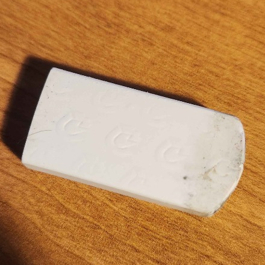

<p align="center">
  
</p>

<h1 align="center">🪄 Efface Magique LR</h1>

<p align="center">
  <b>Free, Private, and 100% Local AI Generative Eraser for Adobe Lightroom Classic</b><br>
  <i>Runs entirely on your machine. Zero cloud subscriptions, zero data leaks, zero monthly costs.</i>
</p>

<p align="center">
  <a href="#-easy-download-for-other-users"></a>
  <a href="#-quick-installation"></a>
  <a href="#-how-to-use"></a>
  
</p>

---

## 🌟 Overview

**Efface Magique LR** provides photographers with a private, high-fidelity alternative to Adobe Lightroom's cloud-based Generative Remove. 

Integrated directly into Adobe Lightroom Classic via a native Lua plugin and a hardware-accelerated PyQt6 companion app, it enables you to erase tourists, power lines, trash, and blemishes with a single brush stroke while preserving 16-bit color depth, EXIF metadata, and natural camera sensor noise.

### Key Highlights:
- **🎯 Intelligent Object-Aware Erasing:** Upgraded subject detector automatically locks to the contours of any object (buildings, cabins, signs, poles, vehicles, animals, people) even for distant, small, or low-contrast elements without clipping rooflines, eaves, or posts.
- **📚 Non-Destructive Modification Layers:** Every erase operation is tracked in a sidebar layer stack. Toggle visibility, re-edit masks, or delete any layer with a single click of its dedicated `✕` button.
- **✨ Firefly-Grade Generative Variations:** Generate candidate variations with prompt conditioning or run instant LaMa GAN spot healing.
- **⚡ Seamless Live Window:** Stays open while you browse photos in Lightroom; edits auto-stack into your catalog upon save.

---

## 📥 Easy Download for Other Users

You do **not** need Git or programming experience to install and use Efface Magique LR:

### Option 1: Download Pre-Packaged Release (Recommended for Most Users)
1. Download **`Efface-Magique-LR.zip`** from the [GitHub Releases](https://github.com/LLiu223/efface-magique-lr/releases) page or from your shared team drive.
2. Extract the ZIP file anywhere on your computer (e.g., `Documents` or `C:\Tools\Efface-Magique-LR`).
3. Follow the **[Quick Installation](#-quick-installation)** steps below.

### Option 2: Build a Distribution ZIP to Share with Friends
If you already have this repository cloned, you can create a clean, portable distribution package to share:
- **Windows:** Double-click `package_release.bat` in the project root.
- **In-App:** Open the app, click **💡 Help & Guide** in the toolbar, switch to the **📥 Download & Share** tab, and click **📦 Package Distribution ZIP**.
- **Terminal:** Run `python package_release.py`.

The clean archive is created in `dist/Efface-Magique-LR.zip` and automatically revealed in File Explorer!

---

## 🚀 Quick Installation

### Step 1: Install Dependencies (1-Click)

Run the automated installer inside the project directory:

- **Windows:** Double-click `install.bat` (or run `install.bat` in Command Prompt / PowerShell).
- **macOS / Linux:** Open Terminal in the project folder and run:
  ```bash
  chmod +x install.sh && ./install.sh
  ```

*The installer automatically configures a dedicated Python virtual environment (`.venv`) with PyTorch, Simple-LaMa, and all required AI libraries.*

---

### Step 2: Add the Plugin to Adobe Lightroom Classic

1. Open **Adobe Lightroom Classic**.
2. Open the **Plug-in Manager**:
   - Menu: **File > Plug-in Manager...**
   - Shortcut: `Ctrl + Alt + Shift + ,` (Windows) or `Cmd + Opt + Shift + ,` (macOS).
3. Click the **Add** button in the bottom-left corner of the dialog.
4. Browse to the project folder and select:
   ```
   efface-magique-lr/plugin/ai_eraser.lrplugin
   ```
5. Confirm that the status indicator shows **🟢 Installed and running**.
6. Click **Done**. The plugin is now permanently enabled across all your Lightroom catalogs!

---

## ✨ How to Use

### ⚡ Mode 1: Seamless Live Window Sync (Recommended)

Work through your entire photoshoot without ever relaunching or closing the editor:

1. In Lightroom Classic, select any photo and choose:  
   **File > Plug-in Extras > ⚡ AI Generative Eraser (Live Window)...**
2. The companion window opens, automatically loading your active photo.
3. **Keep the window open:** As you browse through photos in Lightroom using your arrow keys or the Filmstrip, the companion window **updates instantly in real time**!
4. **Erase unwanted elements:** Paint over tourists, power poles, or dust spots with the red brush. Use `[` and `]` to adjust the brush diameter.
5. **Smart Object Selection (🎯 Subject):** Toggle **Subject** to automatically isolate and snap to the object's boundary. Our multi-cluster local background sampling and adaptive edge saliency preserve thin posts, eaves, and rooflines on distant/small structures so no wireframe outlines remain.
6. **Generate Inpainting:** Click **✨ Erase Object** (or press `Enter`).
7. **Pick a Variation:** Efface Magique generates distinct candidate variations. Click any thumbnail card or press `1`, `2`, or `3` to select your favorite.
8. **Manage Modification Layers:** Inspect each modification in the sidebar:
   - Click the checkmark (`✓`) to toggle a layer's visibility on/off.
   - Click the delete button (`✕`) on any card to permanently delete that layer with automatic, clean re-compositing.
   - Click any card to re-enter edit mode and refine its mask.
9. **Save & Sync:** Click **⚡ Save & Sync to Lightroom** (or press `Ctrl + S`).  
   - The edited photo is losslessly exported as a 16-bit ProPhoto TIFF.
   - Lightroom automatically imports and stacks the edited version with the original photo.
   - The companion window **stays open**, ready for your next photo!
10. **Stay Floating:** Click **📌 Pin** (or press `Ctrl + T`) to keep the editor floating smoothly above Lightroom.

---

### 🪄 Mode 2: Single Photo Mode

For one-off adjustments on a single image:
1. Select a photo in Lightroom Classic.
2. Go to **File > Plug-in Extras > 🪄 AI Generative Eraser (Single Photo)...**
3. Perform your edits, click **⚡ Save & Sync to Lightroom** (`Ctrl + S`), and close the companion window when finished.

---

### 🧪 Mode 3: Standalone Desktop App (Without Lightroom)

You can also use Efface Magique as a standalone desktop photo eraser:
- **Windows:** Double-click `companion.bat`.
- **macOS / Linux:** Run `./companion.sh`.
- Click **📂 Open** in the toolbar to load any JPG, PNG, TIFF, or WebP photo.

---

## ⌨ Keyboard Shortcuts

| Shortcut | Action | Description |
| :--- | :--- | :--- |
| **`Ctrl + S`** / **`Ctrl + Shift + S`** | **⚡ Save & Sync to Lightroom** | Saves 16-bit TIFF, auto-stacks into Lightroom catalog, and stays open |
| **`Enter`** / **`Return`** | **✨ Erase Object** | Runs local AI inpainting on painted mask |
| **`Ctrl + T`** | **📌 Toggle Pin** | Keeps window floating always on top of Lightroom Classic |
| **`[` / `]`** | **Brush Size** | Decrease / Increase brush radius |
| **`Ctrl + Z`** | **↶ Undo** | Undo stroke or inpainting action |
| **`Ctrl + Y`** / **`Ctrl + Shift + Z`** | **↷ Redo** | Redo stroke or inpainting action |
| **`Spacebar` (Hold)** / **`\`** | **👁 Compare Before / After** | Temporarily displays original photo for instant comparison |
| **`Y`** | **◫ Split Screen Slider** | Interactive before/after split-screen wiper |
| **`Ctrl + 0`** / **`F`** | **🔍 Fit to Screen** | Resets zoom to fit image viewport |
| **`Ctrl + 1`** | **100% 1:1 View** | Zooms to 100% true pixel scale |
| **`Middle Mouse Drag`** | **Pan Viewport** | Smooth canvas panning |
| **`Mouse Scroll Wheel`** | **Zoom** | Smooth zooming centered at cursor position |
| **`F1`** | **💡 Help & Guide** | Opens interactive in-app guide, shortcuts, and distribution packager |

---

## 🧠 Technology & Engine Modes

| Engine Mode | Technology | Best For |
| :--- | :--- | :--- |
| **✨ Firefly AI** *(Default)* | Multi-seed localized diffusion with noise matching & contextual cropping | Complex object removal, people, background reconstruction, texture synthesis |
| **⚡ Fast Spot** | Fast Fourier GAN (Simple-LaMa) | Small spots, sensor dust, blemishes, thin power wires |

### Color & Photographic Quality
- **16-bit Color Pipeline:** Full preservation of 16-bit ProPhoto RGB and Adobe RGB color spaces.
- **Sensor Noise Matching:** Automatically estimates camera ISO noise in the surrounding area and injects monochromatic grain to eliminate plastic-looking patches.
- **Sigmoid Alpha Blending:** High-resolution feathering with zero pixel blur on untouched regions.
- **Object-Aware Saliency Engine:** Multi-cluster local background sampling in CIE-Lab, CLAHE Sobel gradient energy, adaptive Otsu bimodal segmentation, solid contour hole-filling, and proportional safety margins.
- **Non-Destructive Layer Architecture:** In-memory composite caching, per-layer modification history, instant toggle/delete re-compositing.

---

## 🛠 Troubleshooting & FAQ

- **"Python not found" or plugin fails to start:**  
  Make sure you completed Step 1 by running `install.bat` (Windows) or `./install.sh` (macOS/Linux). The plugin automatically searches for `.venv\Scripts\python.exe` inside the project folder.
- **GPU Acceleration:**  
  Efface Magique automatically detects and leverages NVIDIA CUDA GPUs on Windows/Linux and Apple Silicon Metal Performance Shaders (MPS) on macOS. On systems without a dedicated GPU, it automatically falls back to optimized multi-threaded CPU processing.
- **Lightroom Plugin Status:**  
  If the plugin shows a red dot in Plug-in Manager, select it, click **Disable**, and then click **Enable**.

---

## 📁 Repository Structure

```
efface-magique-lr/
├── package_release.bat               # 1-Click script to package distribution ZIP
├── package_release.py                # Release packager (excludes caches/.venv)
├── install.bat                       # Automated Windows installer
├── install.sh                        # Automated macOS/Linux installer
├── companion.bat                     # Windows launcher for companion app
├── companion.sh                      # Unix launcher for companion app
├── requirements.txt                  # Python dependencies
├── README.md                         # Documentation & user guide
│
├── plugin/
│   └── ai_eraser.lrplugin/           # Adobe Lightroom Classic Plugin
│       ├── Info.lua                  # Plugin manifest, menu hooks, & hotkeys
│       ├── GenerativeEraser.lua      # Single photo workflow & auto-stacking
│       ├── LiveBridge.lua            # High-speed background IPC bridge for Live Window
│       ├── PluginUtils.lua           # Environment detection & CLI launcher
│       └── logo.png                  # Plugin branding icon
│
├── companion/                        # Python AI Companion Application
│   ├── app.py                        # PyQt6 Main Window, toolbar, & layer cards
│   ├── canvas.py                     # High-res canvas with brush, zoom, & pan
│   ├── layers.py                     # Non-destructive layer model & thumbnails
│   ├── model_engine.py               # AI inpainting pipelines (Firefly & Fast Spot)
│   ├── pipeline.py                   # Contextual cropping, blending, & grain matching
│   ├── live_bridge.py                # Non-blocking IPC TCP bridge server
│   ├── utils/
│   │   ├── subject_detector.py       # Multi-cluster object-aware subject isolation
│   │   └── blending.py               # Photographic blending facades
│   └── assets/                       # Branding logos & UI icons
│       ├── logo.png                  # 440x440 App logo
│       ├── logo.ico                  # Multi-resolution Windows application icon
│       └── checkmark.png             # Crisp checkbox checkmark icon
│
└── tests/                            # Automated test suite (90+ unit/integration tests)
```

---

## 📄 License

Efface Magique LR is licensed under the **MIT License**. Free for personal and commercial photography workflows.
